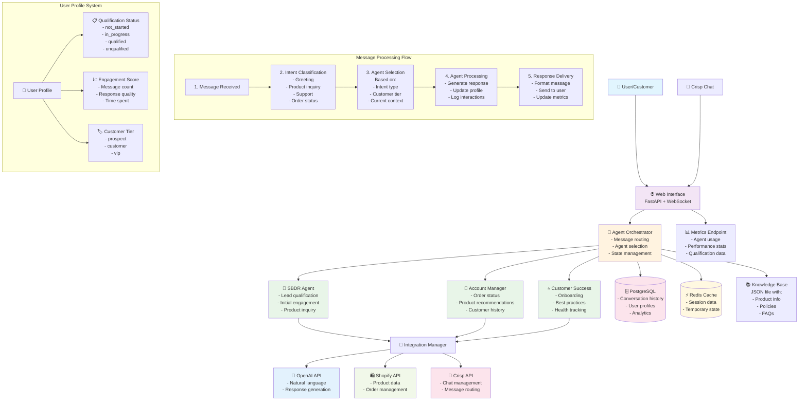
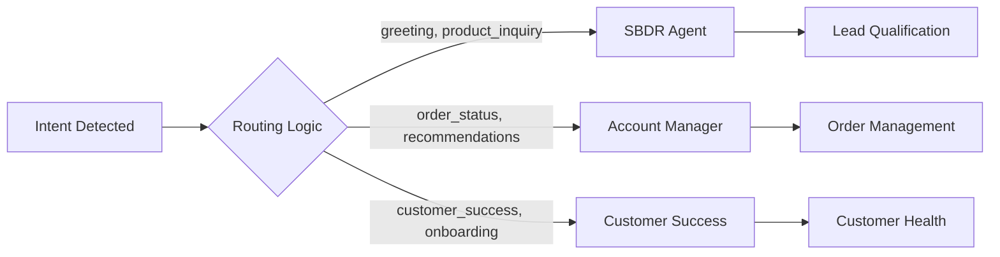

# SBDR Multi-Agent System - Information Flow Diagram



## Key Information Flows

### 1. **Inbound Message Flow**
```
User Message → Web Interface → Orchestrator → Intent Analysis → Agent Selection → Response Generation
```

### 2. **Agent Decision Flow**


### 3. **Data Persistence Flow**
```
Agent Response → User Profile Update → Conversation History → Database Storage → Analytics
```

### 4. **Integration Data Flow**
- **OpenAI**: Natural language processing and response generation
- **Shopify**: Product data retrieval and order information
- **Crisp**: External chat platform integration
- **Knowledge Base**: Static information lookup (policies, FAQs, product details)

### 5. **Real-time Communication**
```
WebSocket Connection → Live Chat → Immediate Response → State Synchronization
```

## Agent Specialization

| Agent | Primary Function | Key Data Sources | Outputs |
|-------|-----------------|------------------|----------|
| **SBDR** | Lead qualification, initial engagement | Knowledge base, user input | Qualification status, engagement score |
| **Account Manager** | Order management, product recommendations | Shopify API, user history | Order updates, product suggestions |
| **Customer Success** | Onboarding, best practices, health tracking | User profile, interaction history | Success metrics, health scores |

## Data Storage Strategy

- **PostgreSQL**: Persistent conversation history, user profiles, analytics
- **Redis**: Session caching, temporary state, real-time data
- **Knowledge Base JSON**: Static reference data for quick lookup
- **In-memory**: Current conversation context, agent state

## Monitoring & Analytics

The system tracks:
- Agent usage statistics
- Qualification conversion rates
- Response times
- User engagement metrics
- System health indicators

This architecture ensures scalable, maintainable multi-agent conversations with proper data flow and state management.